**Гайд**
# Что такое нейроскрайб

Это российская нейросеть для создания контента для копирайтеров, контент-менеджеров, блоггеров и всех, кто работает с постами, статьями, контент-планами и другими видами текстов.

# Регистрация и вход в нейросеть

Для того, чтобы начать пользоваться нейроскрайб, необходимо зарегистрироваться (войти через аккаунт Google или последовательно ввести имя, логин, адрес электронной почты и пароль) и получить бесплатный доступ на 7 дней.

По истечению 7 дней необходимо выбрать тарифный план, который устроит тебя больше всего.

Тарифные планы отличаются количеством символов, которые ты сможешь использовать для запросов, а также количеством транскрибаций из речи в текст и количество МБ для загрузки аудиофайлов.
# Шаблоны заданий
В нейроскрайб более 50 шаблонов, которые намного облегчают работу с контентом и текстами. Давай разберем каждый из них. Ты сможешь выбрать нужный шаблон с помощью содержания.

## Идеи для статьи

Шаг 1: выбери шаблон “Идеи для статьи”.

Шаг 2: укажи, о чем твой блог, и нажми на кнопку “Создать”

Ты получишь подборку идей для постов или статей для блога в течении 1 минуты. 

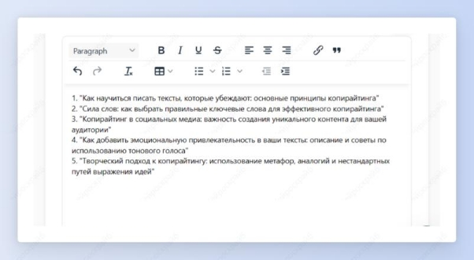
 ## Заголовки для статьи

Шаг 1: выбери шаблон “Заголовки для статьи”.

Шаг 2: введи нужную тему статьи и нажми на кнопку “Создать”.

Получи 10 креативных заголовков на заданную тему.

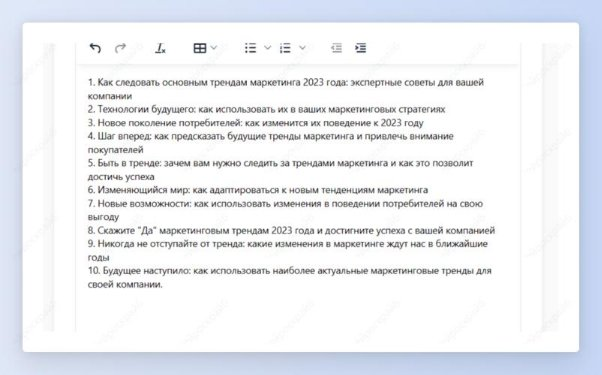

 ## Абзацы для статьи

Шаг 1: выбери шаблон “Абзацы для статьи”

Шаг 2: введи название статьи и название абзацев, которые должны быть в статье.

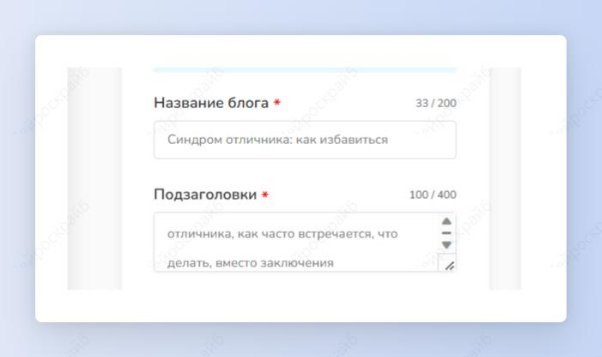

Получи расписанную по заданным абзацам статью.

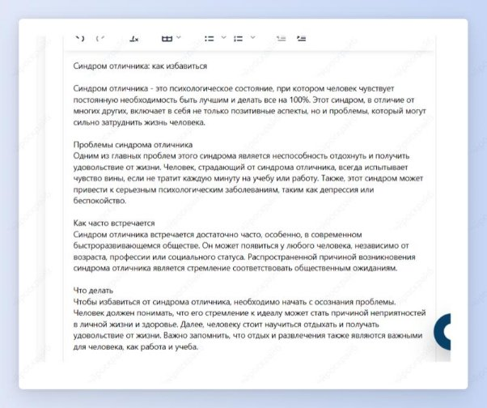
 ## Готовая статья

Шаг 1: выбери шаблон “Готовая статья”.

Шаг 2: введи название статьи и ключевые слова, нажми на кнопку “Создать”.

Перед тобой готовая статья на заданную тему.

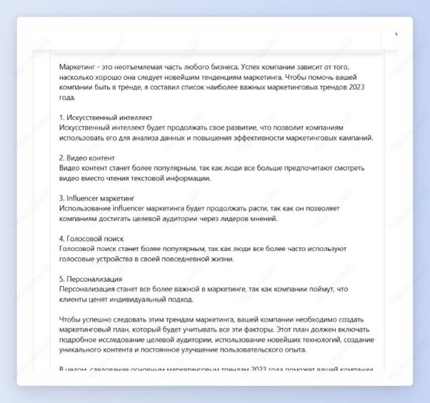

 ## Вступление и заключение для статьи

Шаг 1: сначала создай вступление для своей статьи. Выбери шаблон “Вступление для статьи”.

Шаг 2: введи название статьи и о чем она. Нажми на кнопку “Создать”.

Получи качественно вступление для статьи, которое заинтересовывает с самых первых слов. Сохрани его, нажав на “файлик” над готовым текстом.

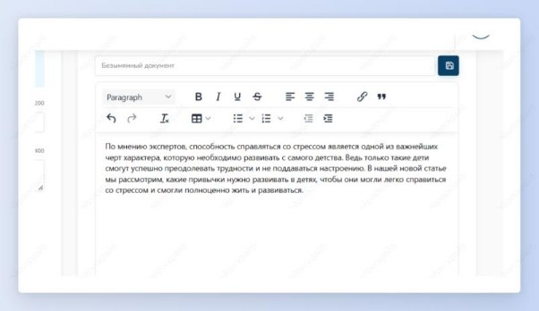

Шаг 3: теперь создай заключение для статьи за пару шагов. Выбери шаблон “Заключение для статьи”.

Шаг 4: введи название статьи, о чем она и нажми на кнопку “Создать”.

Получи оригинальное заключение своей статьи.

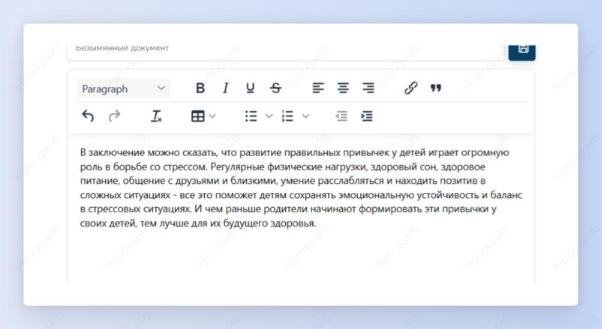

 ## Рерайт и перефразирование

Шаг 1: выбери шаблон “Рерайт статьи”.

Шаг 2: вставь в необходимое поле статью для рерайта и заполни ключевые слова.

Например, необходимо сделать рерайт статьи про самую мощную вспышку на Солнце [Самая мощная вспышка на Солнце в истории - Mydiscoveries.ru](https://mydiscoveries.ru/samaya-moshhnaya-vspyishka-na-solntse-v-istorii)

Для этого скопируй статью с сайта и вставь в нейроскрайб. Введи ключевые слова и нажми на кнопку “Создать”.

Получи вот такую статью.

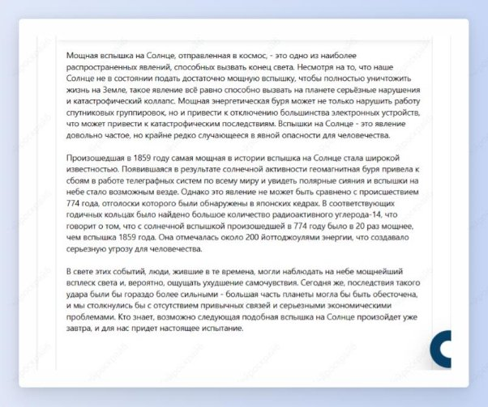

Давай проверим ее уникальность.

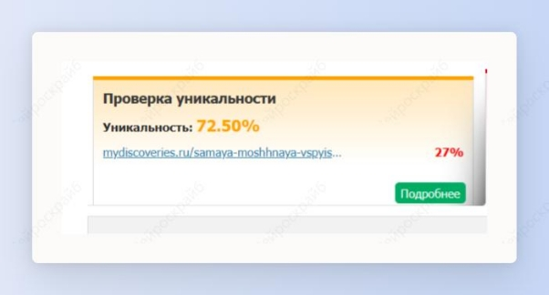

Уникальность 72,5% - прекрасный результат!

Шаг 3: а теперь попробуй перефразировать контент. Для этого выбери шаблон “Перефразировать контент”.

Шаг 4: вставь нужную статью и выбери тон текста “Забавный” (можно выбрать любой тон текста).

Получи легкий и смешной текст на заданную тему.

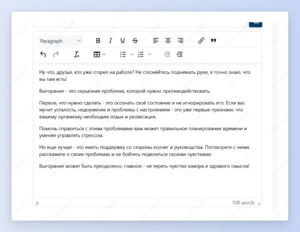

 ## Тезисы для статьи

Шаг 1: выбери шаблон “Тезисы для статьи”.

Шаг 2: введи название статьи и ключевые подзаголовки.

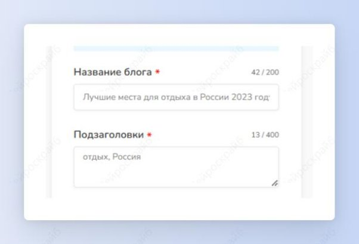

Получи отличные тезисы для статьи, благодаря которым ты быстрее выполнишь свою работу. 

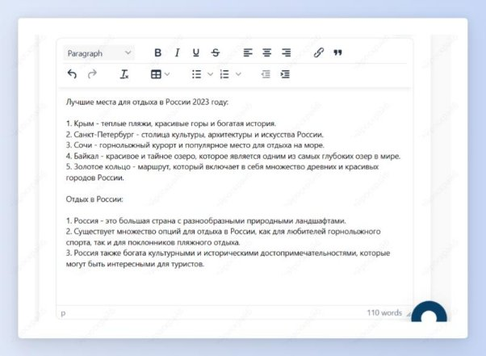

 ## Пошаговая инструкция

Шаг 1: выбери шаблон “Пошаговая инструкция”.

Шаг 2: введи тему инструкции и для чего она необходима. Нажми кнопку “Создать”.

Получи расписанную по шагам инструкцию с милой припиской от создателей нейроскрайба.

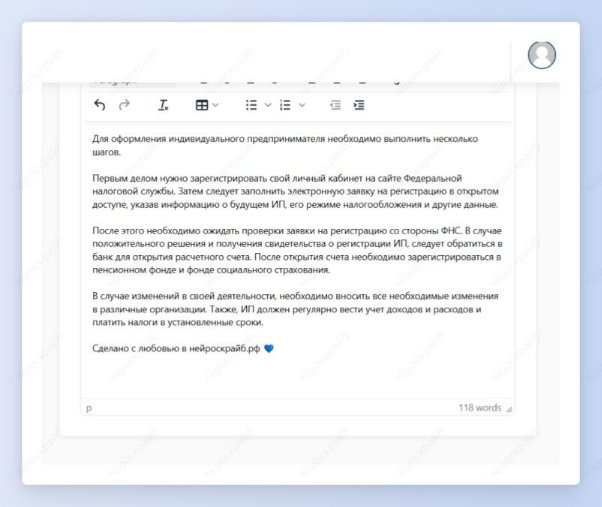

 ## Идеи трендов в нише

Шаг 1: выбери шаблон “Идеи трендов в нише”.

Шаг 2: напиши тему блога и нажми кнопку “Создать”.

Получи главные тенденции в заданной сфере.

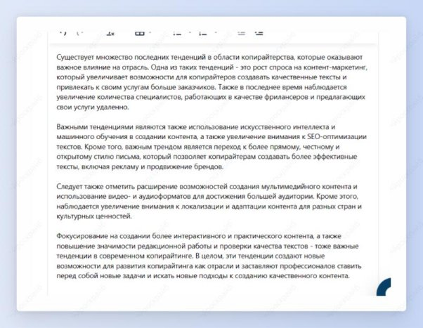

 ## Рекламные объявления в Яндекс, VK и TenChat

Шаг 1: в шаблонах  в разделе “Маркетинг” выбери необходимую социальную сеть, куда ты собираешься выставить объявление.

Шаг 2: введи название продукта и его описание, а также заполни поле про целевую аудиторию и нажми на кнопку “Создать”.

Объявление для VK:

Объявление для Яндекс для того же продукта:

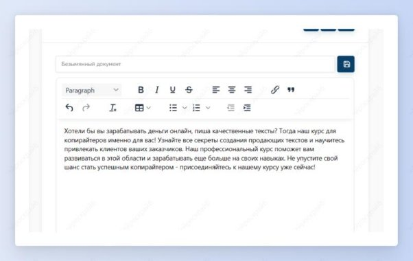

Рекламное объявление для TenChat снова для того же продукта:

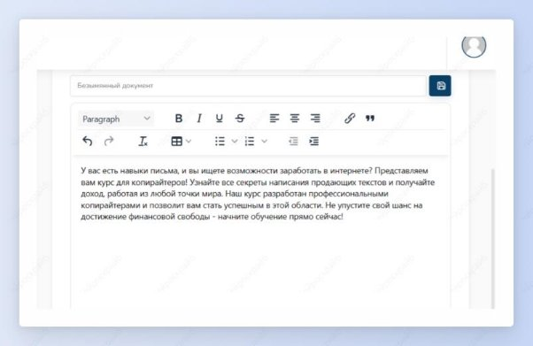

Перед тобой 3 разных текста, которые подстраиваются под особенности определенной социальной сети.

 ##  Маркетинговый текст по AIDA

Шаг 1: выбери шаблон “Маркетинговый текст по AIDA”.

Шаг 2: введи описание своего проекта и целевую аудиторию.

Получи маркетинговый текст для своей компании за 2 минуты!

##
 ##  Идеи партнерских программ

Шаг 1: выбери шаблон “Идеи реферальной программы”.

Шаг 2: введи всю информацию про свою нишу, целевую аудиторию и задачи, которые ты хочешь выполнить с помощью реферальной программы. Нажми на кнопку “Создать”.

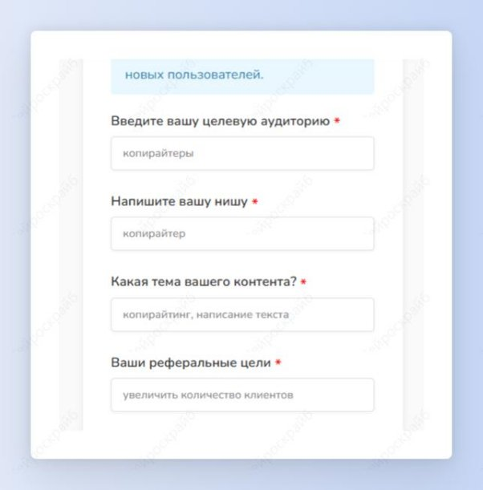

Получи несколько идей реферальной программы, которые помогут тебе добиться указанных целей.

 ## Поиск ключевых слов продукта

Шаг 1: выбери шаблон “Поиск ключевых слов”.

Шаг 2: введи название своего продукта или услуги, обязательно подробно его опиши, задай целевую аудиторию и введи пару ключевых слов. Нажми на кнопку “Создать”.

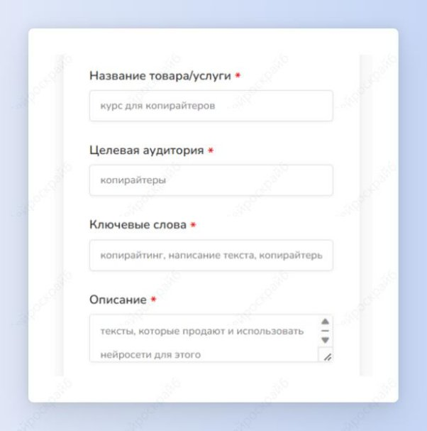

Перед тобой 30 ключевых слов, оптимизированных под SEO, основанных на параметрах твоего продукта или услуги.

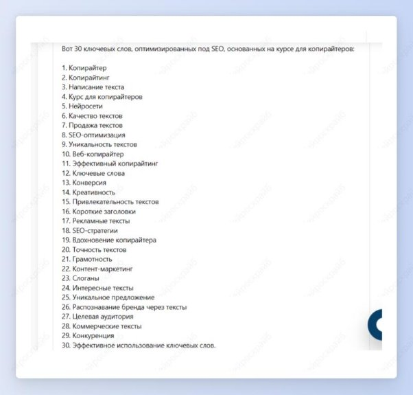

 ## Проблемы и потребности ЦА
Шаг 1: выбери шаблон “Проблемы и потребности ЦА”.

Шаг 2: опиши целевую аудиторию, нишу и название продукта или услуги. Нажми на кнопку “Создать”.

Получи список проблем и потребностей целевой аудитории в указанной нише.

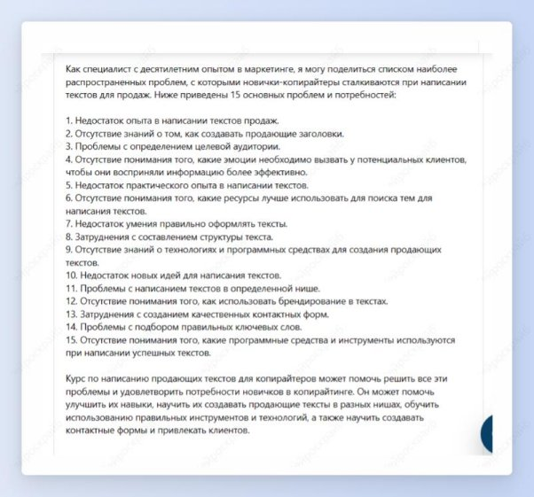

 ## Холодное письмо для рассылки клиентам

Шаг 1: выбери шаблон “Холодное письмо”.

Шаг 2: заполни все необходимые поля. Нажми на кнопку “Создать”.

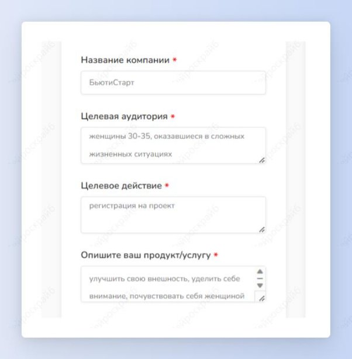

Получи текст холодного письма для рассылки потенциальным клиентам.

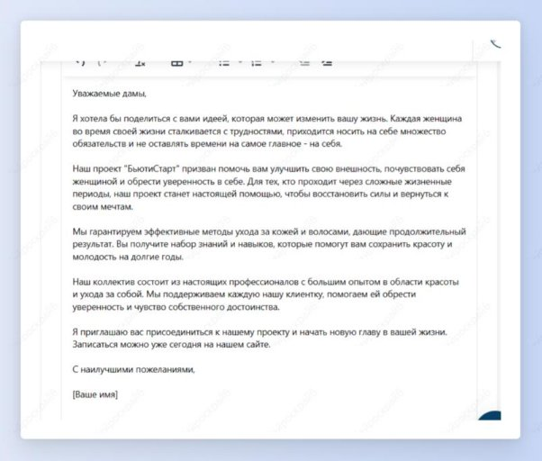

 ## Краткое содержание

Шаг 1: скопируй нужный текст и выбери шаблон “Краткое содержание текста”.

Шаг 2: вставь скопированный текст в нужное поле и нажми на кнопку “Создать”.

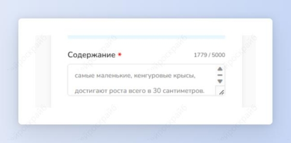

Получи краткое содержание текста.

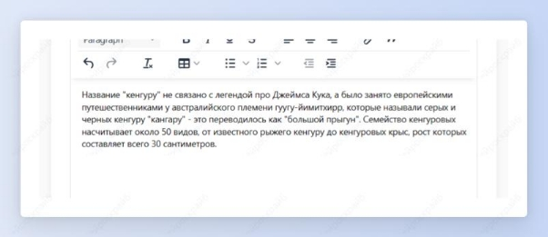

 ## Перефраз текста из сложного в простой

Шаг 1: скопируй сложный текст и выбери шаблон “Резюме для второклассника”.

Шаг 2: вставь скопированный текст. Например, мы взяли объемный текст про модель AIDA [AIDA: 4 этапа принятия решения о покупке, где и как применять | Unisender](https://www.unisender.com/ru/glossary/chto-takoe-aida/?ysclid=lhgvc294ic1701946).

Получи простое и короткое изложение большого и сложного текста.

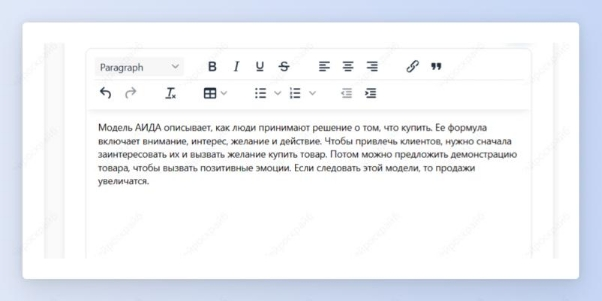
 ## Ответы на вопросы клиентов и ЦА

Шаг 1: выбери шаблон “Ответы на вопросы от клиентов” либо шаблон “Ответы на вопросы вашей ЦА”.

Шаг 2: введи твой вопрос.

Получи оригинальный ответ на вопрос.

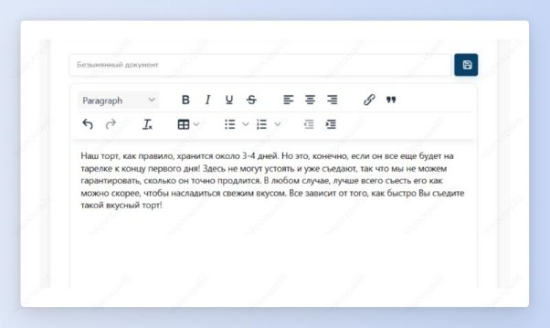

 ## Вопросы и опросы для ЦА

Шаг 1: выбери шаблон “Вопросы для ЦА”.

Шаг 2: укажи свою нишу или аудиторию.

Получи список вопросов, которые ты можешь задать своей аудитории в сториз или в постах.

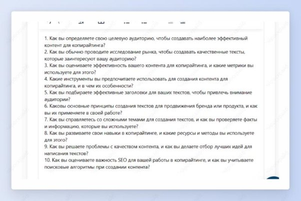

 ## Генератор историй

Шаг 1: выбери шаблон “Генератор историй”.

Шаг 2: укажи целевую аудиторию и опиши проблему или задачу.

Получи увлекательную подробную историю по заданному вопросу, которая идеально подойдет для поста или сториз.

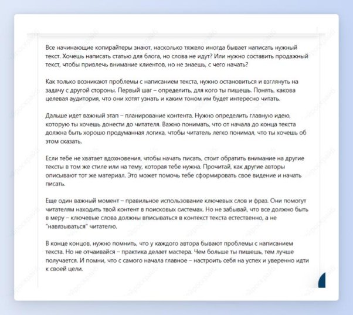
 ## Плюсы и минусы продукта

Шаг 1: выбери шаблон “Плюсы и минусы продукта”.

Шаг 2: опиши свой продукт и нажми кнопку “Создать”.

Получи достоинства своего продукта, которые нужно раскрывать в социальных сетях и на лендинге, а также недостатки - то есть самые частые возражения клиентов.

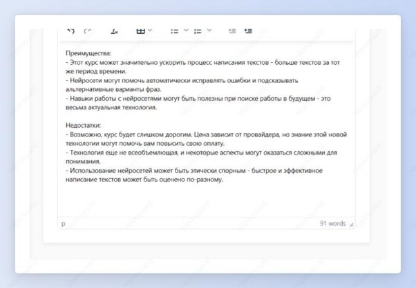

 ## Персональный email

Шаг 1: выбери шаблон “Персональный email”.

Шаг 2: укажи от кого письмо, кому предназначается, его цель и краткое описание, о чем оно. Нажми на кнопку “Создать”.

Получи персональное письмо для рассылки, которое точечно попадает под запросы ЦА.

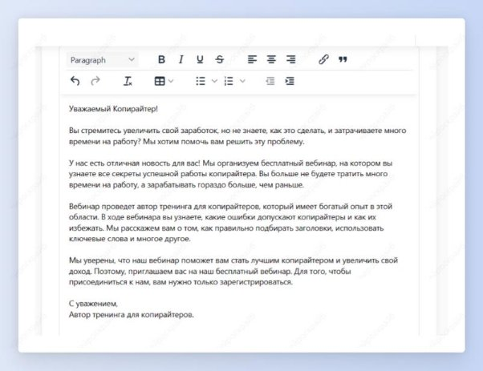

 ## Название для стартапа

Шаг 1: выбери шаблон “Название для стартапа”.

Шаг 2: введи ключевые слова и описание своего стартапа.

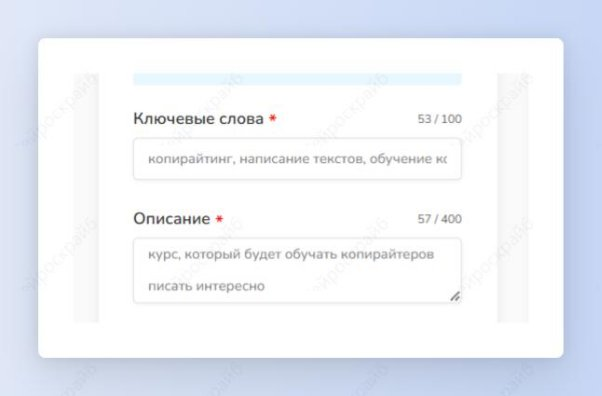

Получи 10 креативных названий.

 ## Bio, цели, задачи и миссия компании
Шаг 1: сначала напишем bio компании. Для этого выбери шаблон “Описание (bio) для компании”.

Шаг 2: заполни необходимую информацию о компании и нажми кнопку “Создать”.

Получи лаконичное описание компании.

Шаг 3: затем создадим цели и задачи компании. Для этого выбери шаблон “Цели и задачи компании”.

Шаг 4: введи снова всю информацию о компании и нажми кнопку “Создать”.

Получи четкое и краткое изложение целей и задач твоей компании.

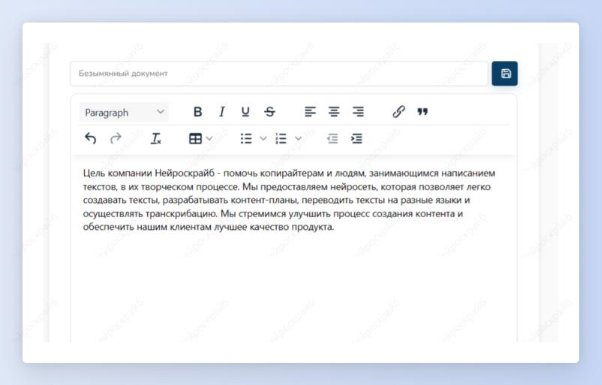

Шаг 5: теперь осталось написать миссию компании. Тут все также предельно просто. Выбери шаблон “Миссия компании”.

Шаг 6: еще раз введи данные компании. Нажми на кнопку “Создать”.

Получи оригинальную миссии компании, привлекающую подходящих специалистов, заказчиков и сотрудников.

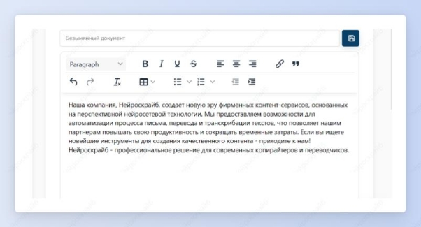

 ## Текст для увеличения конверсии

Шаг 1: выбери шаблон “Текст для увеличения конверсии” в разделе “Написание текстов”.

Шаг 2: опиши продукт/услугу и целевую аудиторию.

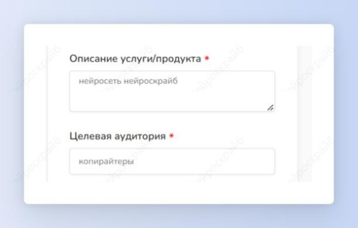

Получи текст, который повысит конверсию на сайте твоей услуги или продукта.

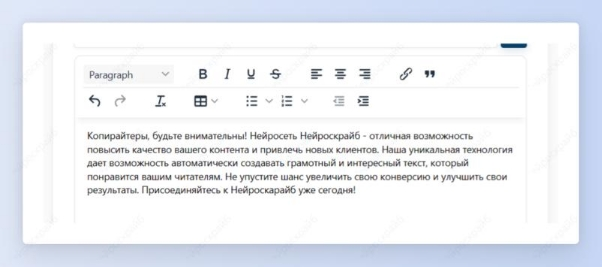

 ## Лучшие практики в нише для определенной цели
Шаг 1: выбери шаблон “Лучшие практики в нише”.

Шаг 2: укажи действие, которого необходимо достичь, и нишу. Нажми на кнопку “Создать”.

Получи самые эффективные практики для достижения поставленной цели в твоей нише.

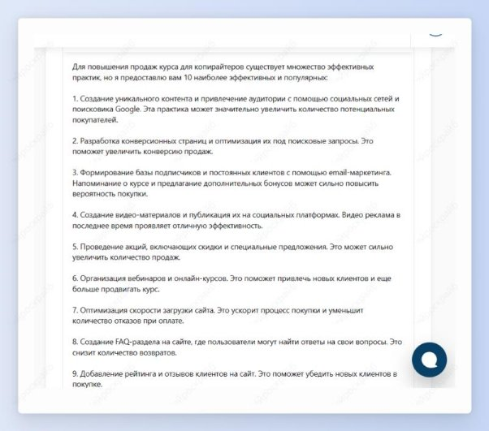

 ##  Названия и описания продуктов в Ozon/Wildberries

Шаг 1: сначала создадим креативное название товара. Выбери шаблон “Название товара Ozon/Wildberries”.

Шаг 2: введи название продукта, его описание и целевую аудиторию и нажми на кнопку “Создать”.

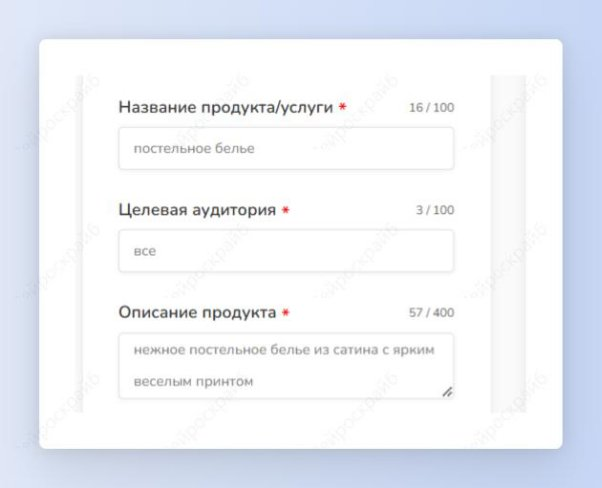

Получи 10 продающих заголовков для описания своего продукта.

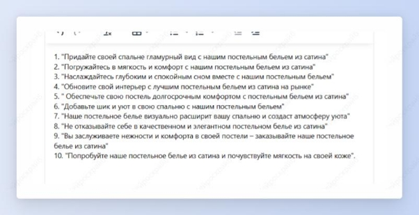

Шаг 3: теперь создадим описание товара. Выбери шаблон “Описание товара Ozon/Wildberries”.

Шаг 4: снова введи все необходимые описания товара (не забудь про ключевые слова) и целевой аудитории и нажми на кнопку “Создать”.

Получи емкое описание, в которое включены все заданные ключевые слова.

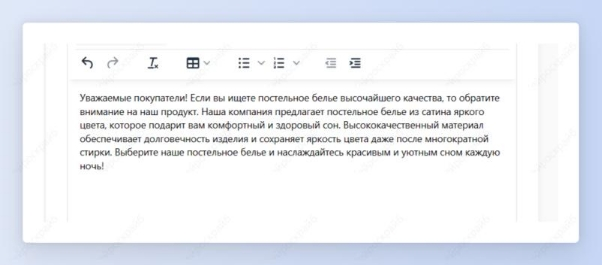

 ## Хэштеги в социальные сети

Шаг 1: выбери шаблон “Хэштеги для нельзяграм”.

Шаг 2: введи информацию о посте, к которому создаешь хэштеги, и нажми на кнопку “Создать”.

Получи трендовые и актуальные хэштеги для постов в социальные сети от нейросети для написания текстов.

 ## Заголовки и описание YouTube-видео
Шаг 1: сначала создадим креативные заголовки. Выбери шаблон “Заголовки YouTube”.

Шаг 2: введи, о чем твое видео, и нажми кнопку “Создать”.

Получи 10 вариантов оригинальных заголовков для видео на YouTube, которые привлекут подписчиков.

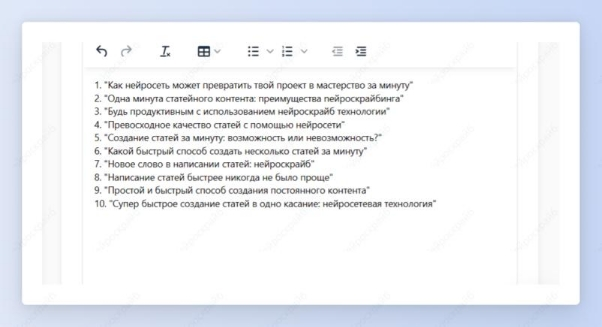

Шаг 3: теперь создадим описание для твоего видео. Для этого выбери шаблон “Описание видео для YouTube”.

Шаг 4: снова введи информацию, о чем твое видео, и нажми на кнопку “Создать”. 

Получи подробное описание для видео, в котором отражено, о чем оно, что в нем интересного и почему пользователю нужно его посмотреть.

 ## Идеи для TikTok и YouTube

Шаг 1: выбери шаблон “Идеи TikTok” или “Сценарий видео YouTube”.

Шаг 2: если ты хочешь получить идеи для TikTok, то введи, о чем твой аккаунт.

Получи 10 идей, которые понравятся твоей аудитории. Скорее иди снимай. Кстати, идеи для TilTok также можно реализовать в Reels и в Shorts.

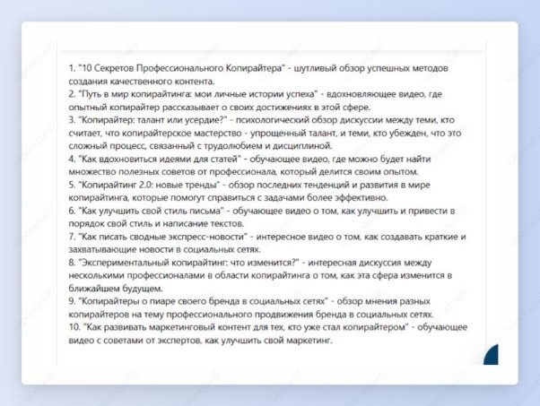

Если ты хочешь получить сценарий для YouTube, то напиши название видео, о чем оно и кто его ЦА.

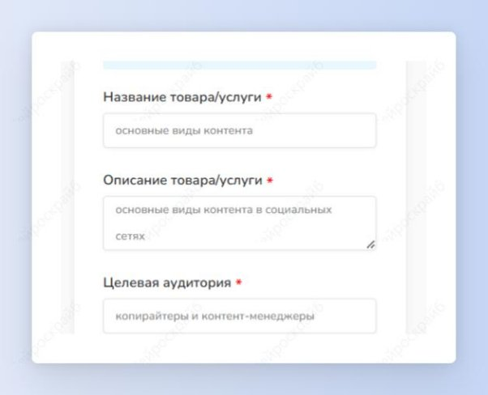

Получи подробный сценарий твоего видео. Успешных съемок!

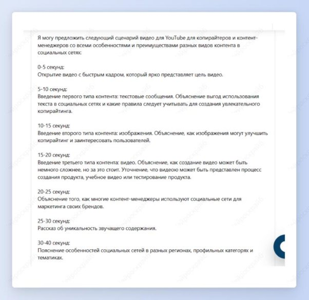
 ## Рекламный текст по AIDA
Шаг 1: выбери шаблон “Маркетинговый текст по AIDA”.

Шаг 2: введи описание своего проекта и целевую аудиторию.

Получи маркетинговый текст для своей компании за 2 минуты!

 ## Заголовки для лендинга
Шаг 1: выбери шаблон “Заголовки для лендинга” в разделе “Для сайта”.

Шаг 2: введи описание услуги или продукта и преимущества для целевой аудитории.

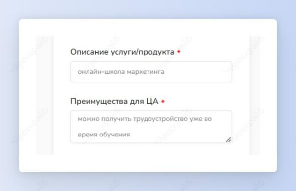

Получи 10 заголовков, которые зацепят пользователя еще на первой странице сайта.

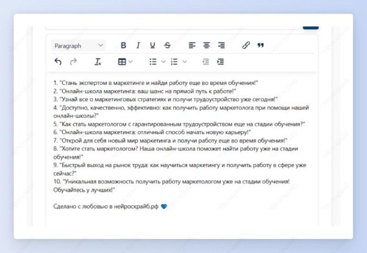

 ## Идеи подкастов
Шаг 1: выбери шаблон “Идеи подкастов”.

Шаг 2: опиши свою нишу, целевую аудиторию и не забудь про ключевые слова.

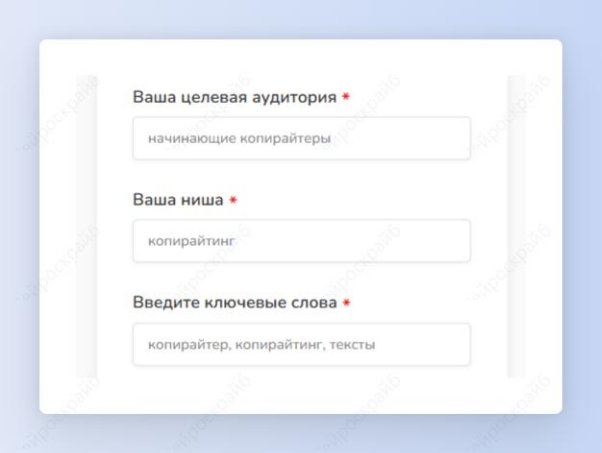

Получи 10 идей подкастов в твоей нише:

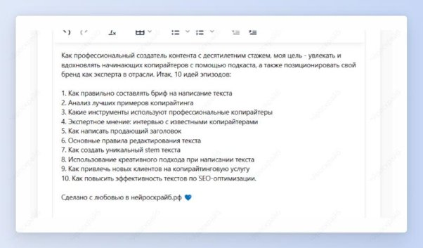

 ## Генератор текста для песни

Шаг 1: выбери шаблон “Генератор текста для песни”.

Шаг 2: укажи тему и жанр.

Текст песни готов!

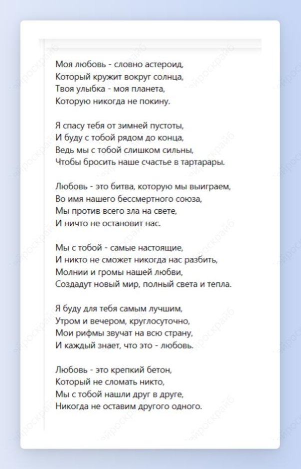

 ## FAQs и ответы на них

Шаг 1: сначала создадим сами FAQs. Выбери шаблон “Генератор FAQs”.

Шаг 2: напиши название и описание продукта. Нажми на кнопку “Создать”.

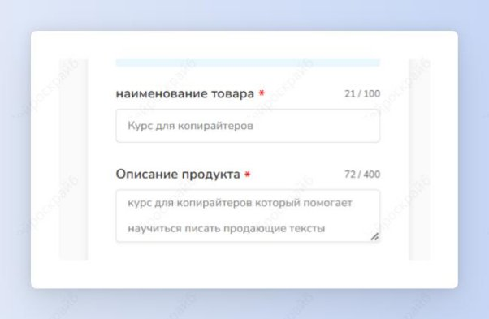

Получи 10 самых частых вопросов по заданному продукту.

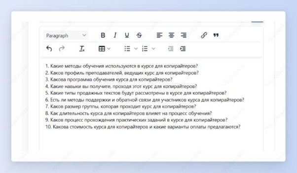

Шаг 3: теперь напишем ответы на любой из FAQs. Выбери шаблон “Ответы для FAQs”.

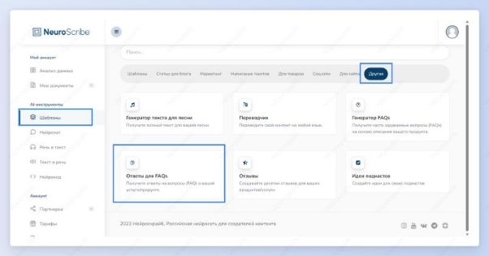

Шаг 4: напиши название продукта и его описание и нужный вопрос. Нажми на кнопку “Создать”.

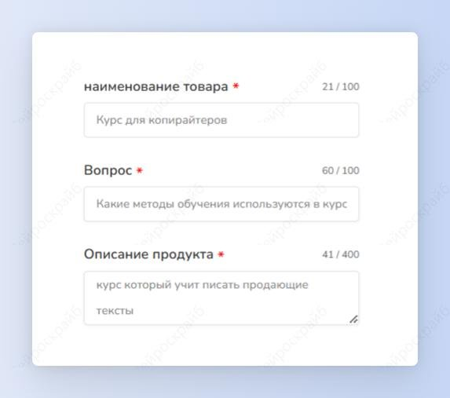

Получи 5 вариантов ответа на заданный вопрос. Повтори со всеми FAQs и будь счастлив!

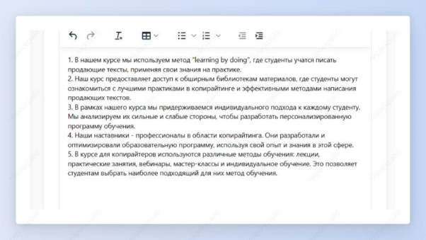
 ## Отзывы

Шаг 1: выбери шаблон “Отзывы” во вкладке “Другие”.

Шаг 2: введи название продукта и его описание. Нажми на кнопку “Создать”.

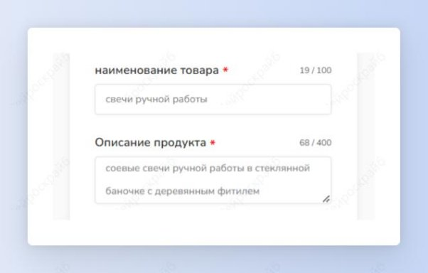

Получи несколько готовых отзывов для своей страницы в социальных сетях либо для продающего лендинга.

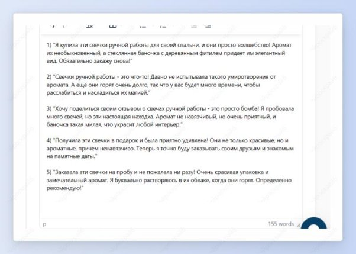

 ## Переводчик

Шаг 1: выбери шаблон “Переводчик”. 

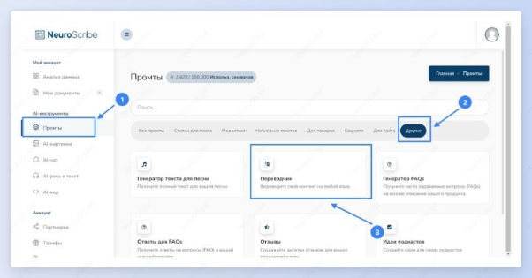

Шаг 2: введи необходимый текст для перевода, тон, язык и другие необходимые параметры. Нажми на кнопку “Создать”.

Получи классный адаптированный для социальных сетей перевод в выбранном забавном тоне.

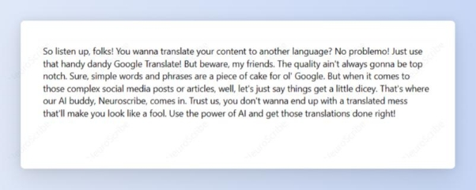

# 4. Настройки параметров

При настройке запросов чаще все используются следующие параметры:

Язык.

Нейроскрайб поддерживает самые популярные языки мира: русский, арабский, китайский, датский, нидерландский, английский, французский, немецкий, иврит, индонезийский, итальянский, хинди, индонезийский, итальянский, японский, польский, румынский, испанский, шведский, турецкий, вьетнамский.

Качество результата.

Ты можешь выбрать один из четырех вариантов, что помогает максимально приблизить текст к языку того человека, от лица которого он пишется.

Тон голоса

В библиотеке тонов голоса нейроскрайба есть 12 вариантов тонов: забавный, повседневный, взволнованный, профессиональный, остроумный, саркастический, женский, мужской, смелый, драматический, четкий, скрытный.

Выбери любой и создавай совершенно разные тексты с легкостью.

Количество результатов

Если тебе, например, необходимо создать более 10 заголовков, то выбери количество результатов “2” и так далее.

Количество символов в результате

Задай то количество символов, которое тебе необходимо для написания статьи или поста.
# 5. Сохранение и использование

Сохрани полученные результаты запросов как в самом нейроскрайбе (, так и в Word (2) или в текстовом файле (3). Также можно скопировать результаты и вставить в нужный источник (4).

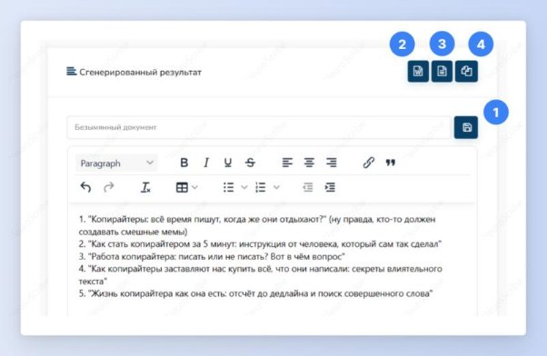

В нейроскрайб сохраненные документы хранятся в разделе “Мои документы”.

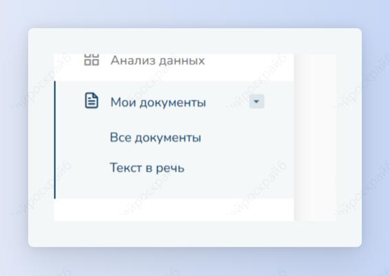

Здесь ты можешь найти как сохраненные текстовые, так и аудиофайлы.

# 6. Заключение
